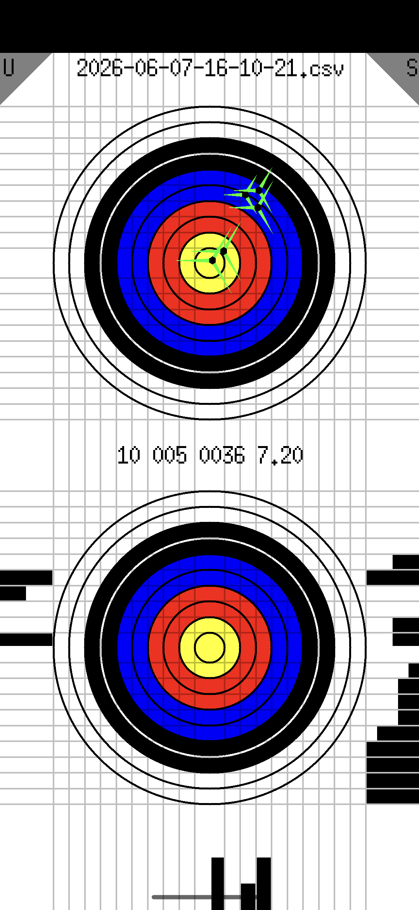

# An Archery Application for Android

And and some lessons for myself.

## Background

A few years back, when I was very interested in archery, I decided that the 
world needed an Android archery application and that I would make a great 
job of that. I've since discovered that all the collected data in the world 
will not really improve your barebow archery, and in retrospect Kyūdōka managed 
pretty well without Android phones, back in the day.

I've always disliked the Java type environment for Android development but 
around that time saw an article on Hackaday about a C development approach 
https://hackaday.com/2020/05/13/writing-android-apps-in-c-no-java-required/

Without that, I wouldn't have managed to build an app and I guess 90% of 
the code here is simply derived from that example. So, standing on the 
shoulders of giants already.

## The Framework

The https://github.com/cnlohr/rawdrawandroid gave me a means by which
I could write triangles on the screen and read the position of the any
screen presses. I thought I could work with just that.

## The User Interface

Quirky, to say the least.

What you immediately notice, after the nausea subsides, is that there 
are two target shapes on the screen. So, when recording where your arrow 
is postioned on the target, you place your finger on the lower target to move 
the arrow position on the upper target. If you make a mistake, then you can undo 
the position by pressing the grey triangle in the upper left corner marker 'U' 
for undo.

As you can see, the arrows stylised with three green fletches. What is less 
apparent is that as you add more arrows the size of the older ones decays 
a little - making the sequence slightly more obvious.

To further clutter the design, there are some black bar histograms
positioned around the lower target. I'm trying to recall here but I
suspect the left hand edge and lower edge are showing the arrow position
distributions. I believe that the others simply relate to the score.
As I recall, the histgrams all normalise so there's no risk of overflowing.

The grey triangle in the top right saves all the shots as a CSV file. 
The file name is shown right at the top of the screen. All I can recall 
about this is that Android was determined not to let me save the file 
anywhere useful - which I think was the final straw. The path embedded 
in the app is `/sdcard/Android/data/org.yourorg.spoods/files` goodness 
knows where it's ended up on the Pixel 4a which I've just installed 
it on - lacking as it does an SD card. I imagine lack of easy access 
to useful areas of the filesystem is some sort of sandboxing thing?

## Development Notes

This was a while back, but I seem to remember making this as an X11 
application - just to get started - and so that I had a nice quick 
turnaround time. I guess the guts of the code is (or perhaps was) 
quite portable. If I did anything like this again then I would 
take the same approach.

I had to do the fonts myself. It was annoying, but at least I can 
have my beloved XTerm default font, so there's that. As a side note, 
the reason I'm revisiting this is because I need font rendering for 
something totally different and I there's stuff here which I can 
easily re-use.

My code here sucks, of course, zero style. At the time I wanted this app 
really badly so I was perhaps less careful than I might otherwise be. That 
said, _it does run_

## The Lessons

* Maybe user interface design is not really one of my strengths ... In my defence, I feel it has a lowish _Data-Ink Ratio_
* In the last couple of hours I managed to revive this ancient Android app just feeding the errors into Google and letting the AI mode help out. I doubt that I could have done this quicker by myself.
* Debian is, yet again, great - I just used the shipped Android SDK (some details in the appendix).
* Sometimes, when you *really* want an App for something, you don't.

## Appendix

Lazily grepping the recent apt-get stuff out of my history:

    sudo apt-get update
    sudo apt-get install android-sdk android-sdk-helper android-platform-tools-adb fastboot default-jdk
    sudo apt-get install google-android-ndk-installer
    sudo apt-get install google-android-ndk-r24-installer
    sudo apt-get install android-sdk-build-tools
    sudo apt-get install google-android-platform-30-installer
    sudo apt-get install zip
    sudo apt-get install unzip

And this:

    make ANDROID_SDK_ROOT=/usr/lib/android-sdk clean all
    adb install spoods.apk
